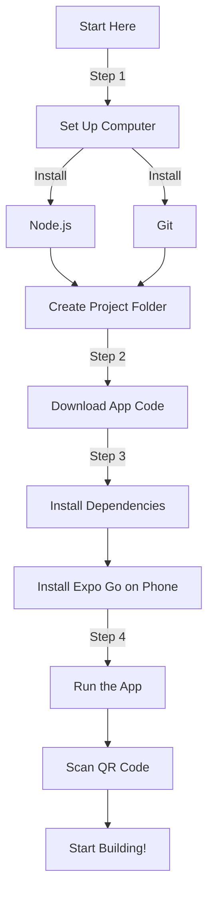
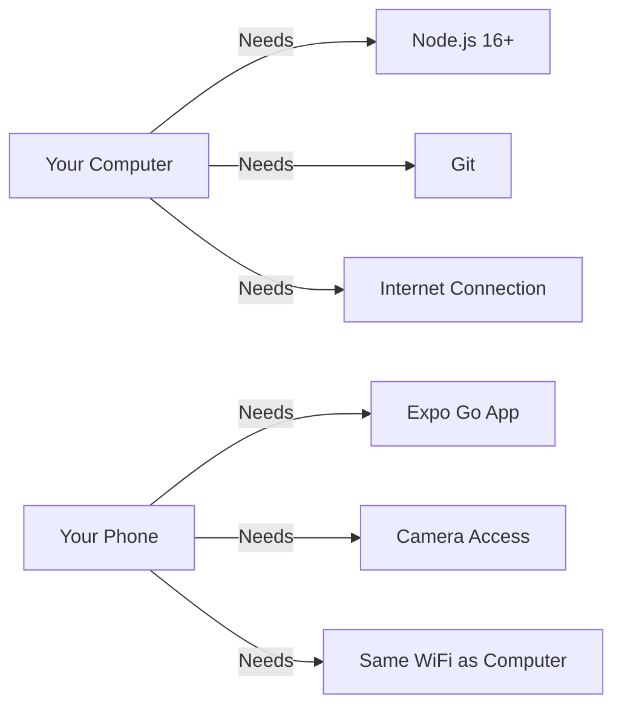

# Epic Homes AR App

An augmented reality application for visualizing and constructing traditional Orang Asli houses.

## 📱 For Epic Homes Team Members

### Installing the App

#### For iPhone Users:
1. Open App Store on your iPhone
2. Search for "Epic Homes AR"
3. Tap "Get" or "Install"
4. Open the app once installed

#### For Android Users:
1. Open Play Store on your Android phone
2. Search for "Epic Homes AR"
3. Tap "Install"
4. Open the app once installed

### Need Help?
Contact our support team at [support email/phone]

---

## 👩‍💻 For Developers

The following sections are for developers who want to modify or build upon the app.

## 📱 Complete Installation Guide for Beginners

### Before You Start: Basic Concepts

#### What is Command Prompt?
Command Prompt (or Terminal) is like a text-based way to tell your computer what to do. Think of it as sending text messages to your computer!

- **How to Open Command Prompt:**
  1. Press `Windows + R` on your keyboard
  2. Type `cmd` and press Enter
  3. You'll see a black window - that's Command Prompt!

#### Important Terms
- **Installing:** Like downloading an app on your phone, but for your computer
- **WiFi Network:** The internet connection your devices use
- **Repository:** Where the app's code is stored online (like a folder in the cloud)
- **QR Code:** A square barcode that your phone can scan
- **Dependencies:** Extra pieces of code our app needs to work

#### Tips for Success
- Follow steps in exact order
- Don't skip any steps
- If something doesn't work, try closing everything and starting fresh
- Keep this guide open while you work

### Installation Overview



### System Requirements Diagram



### Step 1: Setting Up Your Computer

#### Installing Required Software
1. **Install Node.js**
   - Go to [https://nodejs.org](https://nodejs.org)
   - Click the big green "LTS" (Long Term Support) button
   - Once downloaded, double-click the installer
   - Follow the installation steps (click "Next" for all default options)
   - To verify installation:
     - Press `Windows + R` on your keyboard
     - Type `cmd` and press Enter
     - In the black window that opens, type: `node --version`
     - You should see a number like `v16.x.x`

2. **Install Git**
   - Go to [https://git-scm.com/downloads](https://git-scm.com/downloads)
   - Click "Windows"
   - Once downloaded, run the installer
   - Use all default options during installation
   - To verify installation:
     - Open Command Prompt again
     - Type: `git --version`
     - You should see a number like `2.x.x`

### Step 2: Getting the App Code

1. **Create a Project Folder**
   - Open File Explorer
   - Go to your Documents folder
   - Create a new folder called `Projects`
   - Open Command Prompt
   - Type these commands one by one:
     ```bash
     cd Documents
     cd Projects
     ```

2. **Download the App Code**
   - In the Command Prompt, type:
     ```bash
     git clone https://github.com/your-org/epic-homes-ar.git
     cd epic-homes-ar
     ```
   - You'll see some text showing the download progress

### Step 3: Installing the App

1. **Install Project Dependencies**
   - In the same Command Prompt window, type:
   ```bash
   npm install
   ```
   - This will take a few minutes. You'll see a lot of text scrolling by - this is normal!
   - If you see any yellow warnings, don't worry - these are okay

2. **Install Expo Go on Your Phone**
   - Open the App Store (iOS) or Play Store (Android)
   - Search for "Expo Go"
   - Install the app
   - Create an Expo account if prompted

### Step 4: Running the App

1. **Start the Development Server**
   - In Command Prompt, type:
   ```bash
   npx expo start
   ```
   - You'll see a QR code appear in the Command Prompt

2. **Connect Your Phone**
   - Make sure your phone and computer are on the same WiFi network
   - Open Expo Go on your phone
   - For Android:
     - Use Expo Go to scan the QR code
   - For iOS:
     - Open your Camera app
     - Scan the QR code
     - Tap the banner that appears

3. **Using the App**
   - The app will load on your phone
   - If you see any permission requests (for camera, etc.), tap "Allow"
   - Follow the tutorial that appears when the app starts

### Troubleshooting Common Issues

1. **"Command not found" Error**
   - Close Command Prompt
   - Open a new Command Prompt
   - Try the command again

2. **"Port already in use" Error**
   - In Command Prompt, type:
     ```bash
     npx kill-port 19000
     npx expo start
     ```

3. **Phone Can't Connect**
   - Make sure your phone and computer are on the same WiFi
   - Try turning your phone's WiFi off and on
   - Close Expo Go completely and reopen it

4. **App Crashes on Start**
   - Close Expo Go
   - In Command Prompt:
```bash
     npm install
     npx expo start --clear
     ```

### Getting Help

If you run into any issues:
1. Check the Troubleshooting section above
2. Make sure all steps were followed in order
3. Try closing everything and starting fresh
4. Contact our support team at [support email]

## 🛠️ Development Information

## Features

- AR visualization of traditional house designs
- Real-time measurements and placement
- Step-by-step construction guide
- Progress tracking with photo documentation
- Data export and sharing capabilities

## Prerequisites

- Node.js 16.x or higher
- Expo CLI (`npm install -g expo-cli`)
- iOS 13+ or Android 8.0+
- Device with ARKit (iOS) or ARCore (Android) support

## Project Structure

```
epic-homes-ar/
├── app/
│   ├── components/     # Reusable UI components
│   ├── screens/        # Main app screens
│   ├── services/       # Business logic and API services
│   ├── utils/          # Helper functions and utilities
│   └── constants/      # App-wide constants
├── assets/
│   ├── models/        # 3D models and textures
│   └── images/        # App images and icons
└── docs/             # Additional documentation
```

## Key Components

### AR View (app/components/ARView.tsx)
- Handles 3D model rendering
- Surface detection
- Measurement calculations
- Model placement and rotation

### Construction Guide (app/screens/ARScreen.tsx)
- Step-by-step instructions
- Materials and tools lists
- Progress tracking
- Photo documentation

### Data Management (app/services/storage.ts)
- Local data persistence
- Progress tracking
- Export functionality

## Configuration

### Model Dimensions
Default house dimensions are set in `app/utils/measurementValidation.ts`:
- Width: 5.5m - 9.0m (18-30 ft)
- Length: 4.5m - 7.5m (15-25 ft)
- Height: 2.4m - 4.5m (8-15 ft)
- Platform Height: 0.6m - 2.1m (2-7 ft)

To modify these ranges, update the `VALID_RANGES` object.

### Construction Steps
Steps are defined in `app/screens/ARScreen.tsx`. To modify:
1. Locate the `CONSTRUCTION_STEPS` array
2. Edit or add steps following the `ConstructionStep` interface

## Performance Optimization

The app uses several optimization techniques:
- Asset preloading
- Texture compression
- Render optimizations
- Memory management

## Troubleshooting

Common issues and solutions:

1. AR Not Initializing
   - Check device compatibility
   - Ensure sufficient lighting
   - Clear surface required

2. Model Loading Issues
   - Check internet connection
   - Verify model file integrity
   - Clear app cache

3. Progress Not Saving
   - Check storage permissions
   - Verify available space
   - Clear app data if needed

## Maintenance

### Adding New Features
1. Follow the existing component structure
2. Update relevant documentation
3. Add tests for new functionality
4. Update the README if needed

### Updating 3D Models
1. Place new models in `assets/models/`
2. Update model references in `ARView.tsx`
3. Adjust scale and measurements as needed

### Modifying Construction Steps
1. Edit `CONSTRUCTION_STEPS` in `ARScreen.tsx`
2. Update related documentation
3. Test all progress tracking features

## Support

For technical support:
- Create an issue in the repository
- Contact the development team
- Check documentation in `/docs`

## License

[Your License] - See LICENSE file for details
