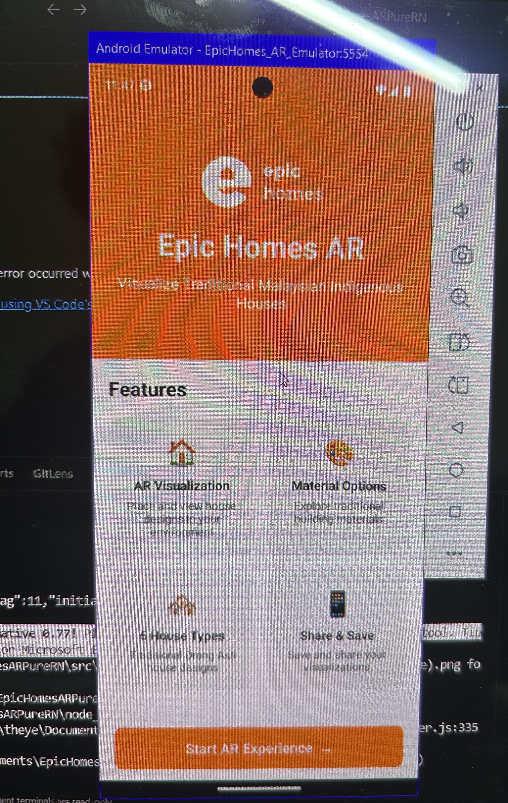

# Epic Homes AR — Visual Housing Prototype (React Native)

**One-line purpose**  
Epic Homes AR helps indigenous families preview and compare house layouts in augmented reality before construction, reducing costly rework and helping families choose materials and layouts with confidence.

**Progress snapshot**  
Active development since June — UI complete; AR core in active development. [View commit history](https://github.com/mehulgupta1001/EpicHomesAR-app/commits/pure-react-native)

---

### Quick preview


<figcaption>UI preview: bilingual onboarding → layout toggle → measurement overlay.</figcaption>

<details>
<summary><strong>Short demo (click to expand)</strong></summary>


</details>

---

### What this project does (30 seconds)
- **Problem:** Families often struggle to visualise architectural plans, leading to mismatched expectations and rework.  
- **Solution:** A bilingual (English/Malay) mobile app that overlays 3D house models into real space so families can assess scale, flow, and materials.  
- **Impact:** Designed for non-technical users; Epic Homes is evaluating the prototype and a demo is scheduled to assess field deployment.

---

### Key features
- Bilingual UI (English / Malay) with simplified onboarding for first-time mobile users  
- Real-time AR placement, measurement overlays, and material toggles  
- Multiple traditional house model variants and basic construction progress tracking  
- Offline compatibility for field use without constant internet access

---

### Technical appendix (for engineers)
- **Tech:** React Native (Pure RN branch), react-native-ar-viewer (AR), TypeScript.  
- **Main challenge:** implementing persistent anchors and lightweight occlusion for low-end Android devices; resolving Expo ↔ native module conflicts required switching branches.  
- **Status:** UI complete and testable; AR anchoring in development (see `docs/AR-notes.md`).

<details>
<summary><strong>Developer notes — click to expand</strong></summary>

This repository branch contains the Pure React Native version of the Epic Homes AR app. The Expo-based version remains on the `master` branch of the same repo (`EpicHomesAR-app`). See the repository here: [EpicHomesAR-app on GitHub](https://github.com/mehulgupta1001/EpicHomesAR-app/).

This is a new [**React Native**](https://reactnative.dev) project, bootstrapped using [`@react-native-community/cli`](https://github.com/react-native-community/cli).

# Getting Started

>**Note**: Make sure you have completed the [React Native - Environment Setup](https://reactnative.dev/docs/environment-setup) instructions till "Creating a new application" step, before proceeding.

## Step 1: Start the Metro Server

First, you will need to start **Metro**, the JavaScript _bundler_ that ships _with_ React Native.

To start Metro, run the following command from the _root_ of your React Native project:

```bash
# using npm
npm start

# OR using Yarn
yarn start
```

## Step 2: Start your Application

Let Metro Bundler run in its _own_ terminal. Open a _new_ terminal from the _root_ of your React Native project. Run the following command to start your _Android_ or _iOS_ app:

### For Android

```bash
# using npm
npm run android

# OR using Yarn
yarn android
```

### For iOS

```bash
# using npm
npm run ios

# OR using Yarn
yarn ios
```

If everything is set up _correctly_, you should see your new app running in your _Android Emulator_ or _iOS Simulator_ shortly provided you have set up your emulator/simulator correctly.

This is one way to run your app — you can also run it directly from within Android Studio and Xcode respectively.

## Step 3: Modifying your App

Now that you have successfully run the app, let's modify it.

1. Open `App.tsx` in your text editor of choice and edit some lines.
2. For **Android**: Press the <kbd>R</kbd> key twice or select **"Reload"** from the **Developer Menu** (<kbd>Ctrl</kbd> + <kbd>M</kbd> (on Window and Linux) or <kbd>Cmd ⌘</kbd> + <kbd>M</kbd> (on macOS)) to see your changes!

   For **iOS**: Hit <kbd>Cmd ⌘</kbd> + <kbd>R</kbd> in your iOS Simulator to reload the app and see your changes!

## Congratulations! :tada:

You've successfully run and modified your React Native App. :partying_face:

### Now what?

- If you want to add this new React Native code to an existing application, check out the [Integration guide](https://reactnative.dev/docs/integration-with-existing-apps).
- If you're curious to learn more about React Native, check out the [Introduction to React Native](https://reactnative.dev/docs/getting-started).

# Troubleshooting

If you can't get this to work, see the [Troubleshooting](https://reactnative.dev/docs/troubleshooting) page.

# Learn More

To learn more about React Native, take a look at the following resources:

- [React Native Website](https://reactnative.dev) - learn more about React Native.
- [Getting Started](https://reactnative.dev/docs/environment-setup) - an **overview** of React Native and how setup your environment.
- [Learn the Basics](https://reactnative.dev/docs/getting-started) - a **guided tour** of the React Native **basics**.
- [Blog](https://reactnative.dev/blog) - read the latest official React Native **Blog** posts.
- [`@facebook/react-native`](https://github.com/facebook/react-native) - the Open Source; GitHub **repository** for React Native.

---

### Contact / verification
Mehul Gupta — mehulgup1001@gmail.com  
Proof: public commit history (link above), UI screenshots in /screenshots, and Epic Homes email confirming prototype review available on request.